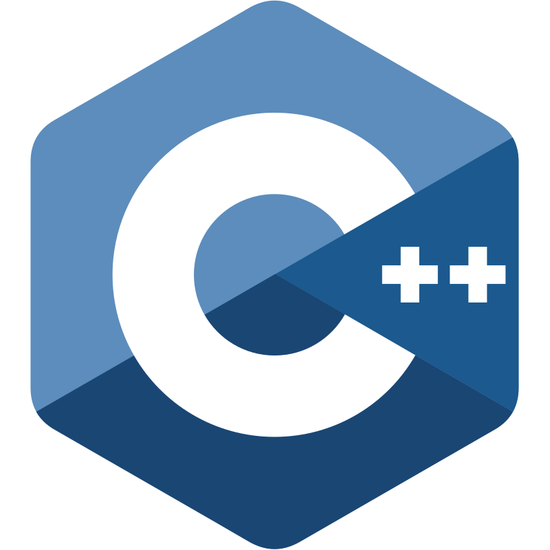
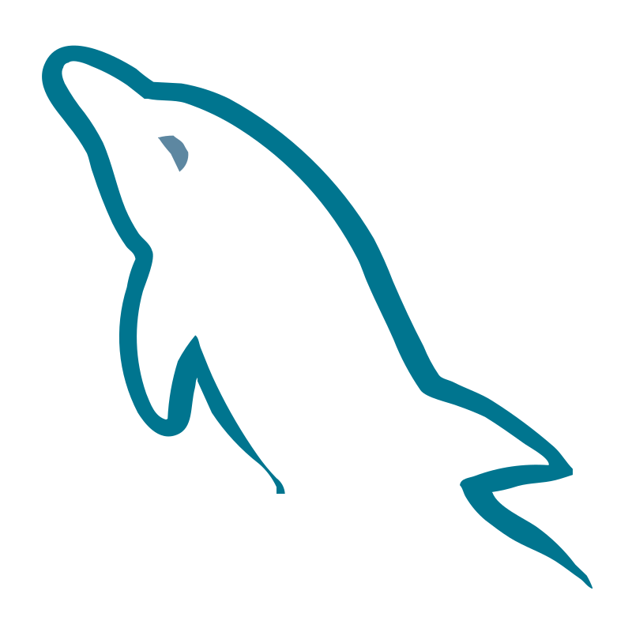
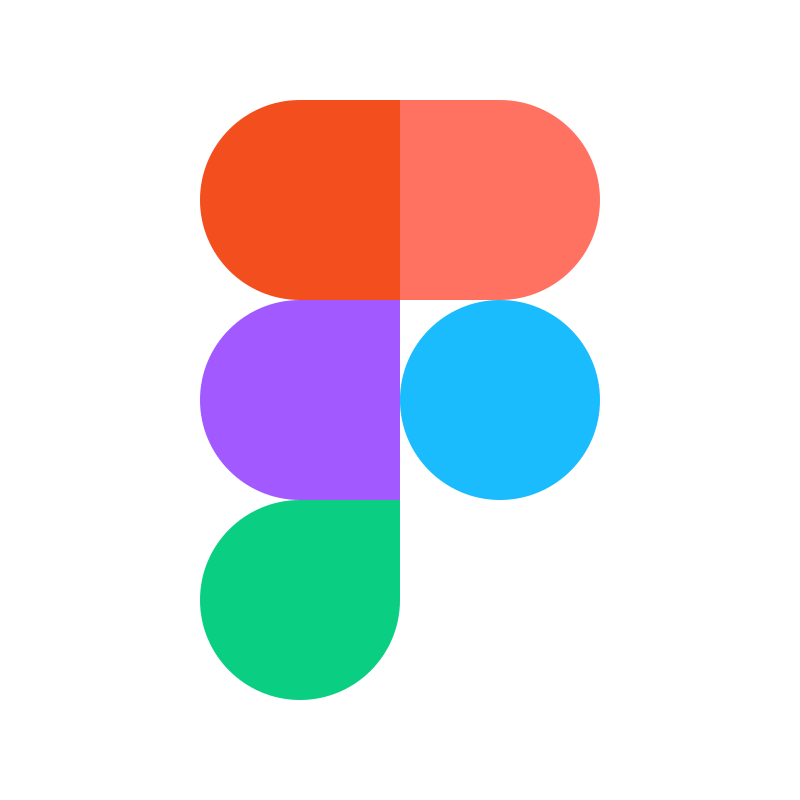
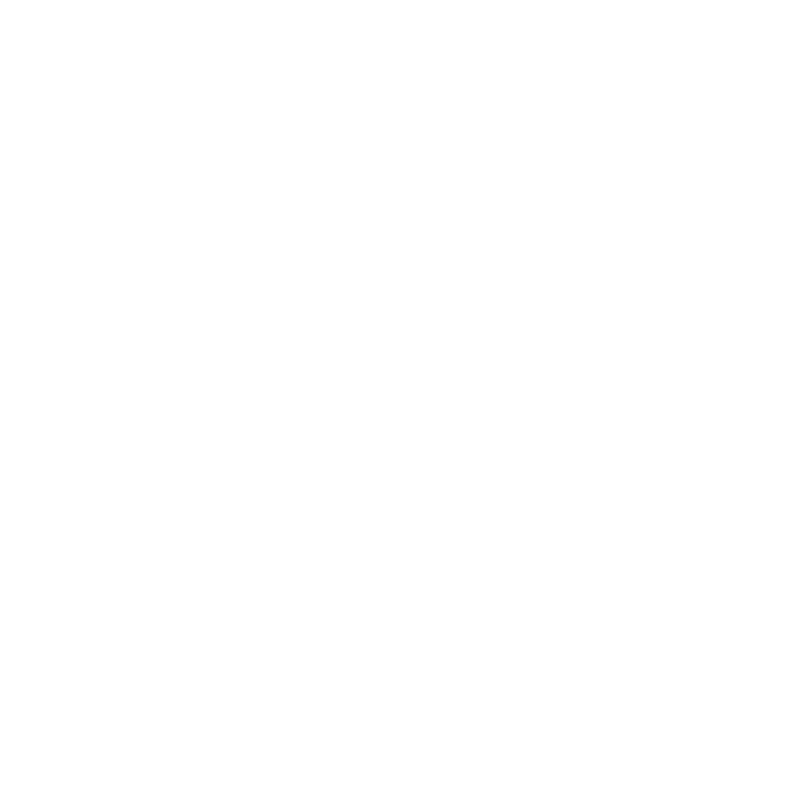
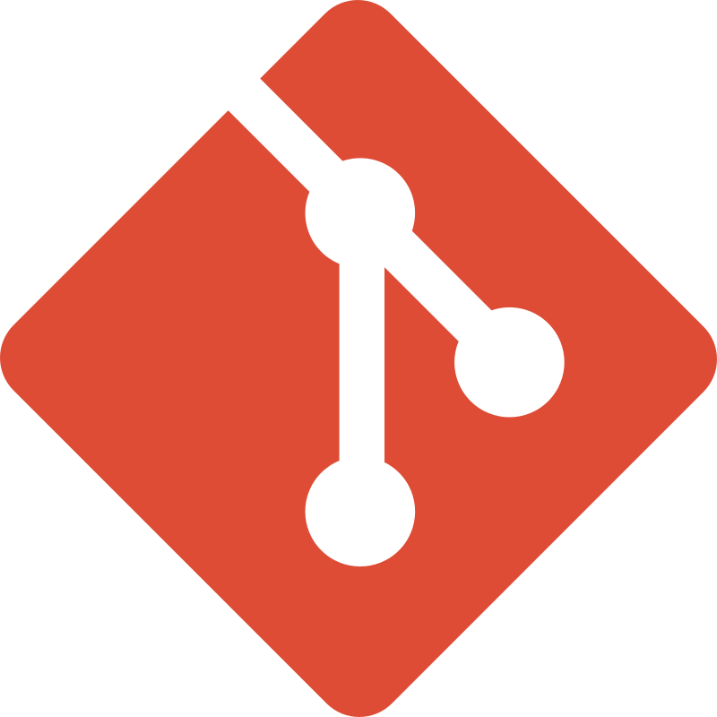
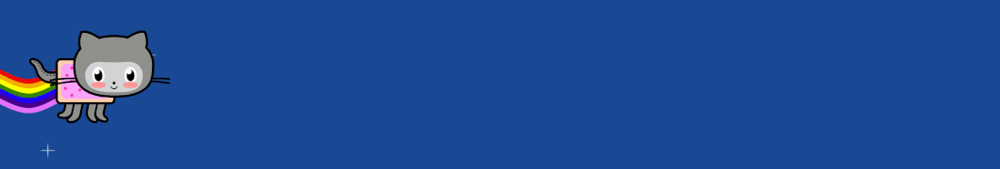

  
  

  

    <code></code>
    <code></code>
    <code></code>
    <code></code>
    <code></code>
    <code></code>
    <code></code>
    <code></code>
  

  

    <code></code>
    <code></code>
    <code></code>
    <code></code>
    <code></code>
    <code></code>
    <code></code>
    <code></code>
  

 

  
  
   
 
      <a href="https://Wa.me//5579999997796" target="_blank">
      <a href="https://www.linkedin.com/in/i74l0" target="_blank"> 
  

 

